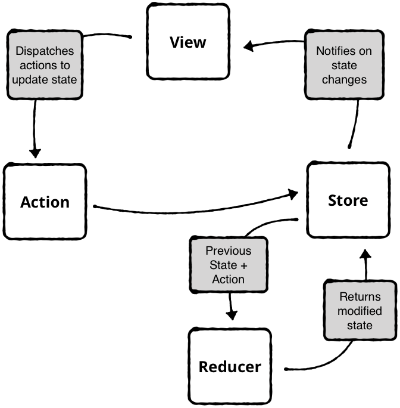

## redux 简介

[ redux](https://redux.js.org/)是一个集中管理JS应用状态的容器，是函数式编程在js中的一个典型应用。

### 3个核心概念

1. Store: 数据状态管理中心
2. Actions: 当数据需要变化时，通过派发actions通知store
3. Reducers: 用于通过actions来生成新数据状态的**纯函数** 

### 主要工作流程

这里有一份关于redux的流程图



1. 全局生成一个唯一的store，其中记录了初始化的state。
2. store里面注册一些监听器，当store中的state发生变化时，自动调用监听器中回调函数。监听器主要是一些View相关的监听器，当state变化时自动更新视图。
3. 当store中的state需要改变时，不能直接修改state，而是通过生成actions来派发给store。
4. store将当前的state以及actions作为参数传递给reducer，reducer根据state和actions生成新的state，并替换store中的原始state。
5. store感知到state变化以后，自动调用监听器中的回调函数（如果是view会触发视图的一些更新）。
6. 循环3-6的工作流程。

### 优点

- reducer都是纯函数，容易debug。
- 由于state改变只能通过派发actions来进行改变，所以很容易的监测、记录state的变化。这就使得可以实现一些state的数据回溯、数据穿g等等。
- 发布订阅模式，简单、高效易于扩展。

## 实现redux

### 1. 实现发布订阅模式

#### 发布订阅模式

> 发布订阅模式又叫做观察者模式，是一种一(发布者)对多(订阅者)的关系。订阅者会在发布者上面订阅特定的事件，当特定事件触发时，发布者会**自动**通知所有该事件的订阅者。

熟悉*dom操作*前端ers都应该使用过`document.addEventListener('onclick', function)`这类的操作，这就是发布订阅模式的一个实现。其中`document`是发布者，`onclick`是订阅事件, `function`是订阅者。

这里我们实现一个生成发布者的函数`createStore`, 它内部通过`listeners`数组来保存订阅函数，并且暴露`subscribe`方法来让外部添加监听器。


```javascript
const createStore = function(initStates) {
  let state = initStates;
  const listeners = [];

	// 订阅方法
  const subscribe = function(listener) {
    listeners.push(listener);
  };

	// 改变state的方法, 改变state后自动触发监听器
  function changeState(newState) {
    state = newState;
    for (let listener of listeners) {
      listener();
    }
  }
	// 获取state的方法
  function getState() {
    return state;
  }

  return {
    getState,
    subscribe,
    changeState
  };
};

```

然后我们编写一个Demo来更好的理解这个模型

```javascript
let initState = {
  counter: {
    count: 0
  },
  info: {
    name: "",
    description: ""
  }
};

// 使用demo
const store = createStore(initState);

store.subscribe(() => {
  let state = store.getState();
  console.log(state.info.name);
});

store.changeState({
  ...store.getState(),
  info: {
    name: "Jaluik",
    description: "前端👨🏻‍💻"
  }
});

// 此时会打印Jaluik

let newInitState = {
  count: 0
};
let newStore = createStore(newInitState);

newStore.subscribe(() => {
  let state = newStore.getState();
  console.log(state.count);
});

newStore.changeState({
  count: newStore.getState().count + 1
});
//打印1

newStore.changeState({
  count: newStore.getState().count - 1
});
//打印0

newStore.changeState({
  count: "abc"
});
// 打印abc

```

#### 模型总结

这是一个发布订阅模型的基本框架: 先注册订阅回调函数，然后状态更新时自动触发回调函数。 

接下来我们需要改进这个模型，使得**state**的改变更加具备可控性。


### 2. 派发**actions**来改变**state** 

> 这一步我们想要更加细力度的控制`state`的改变

对于上一节的`createStore`函数，我们需要做两个调整。

1. 增加`plan`函数作为第一个入参。 之所以命名为`plan`是因为这个函数是用于以后state状态改变时调用的，相当于在为以后做计划。
2. 每次调用**changeState** 函数时，参数不再是`state`，而是传递`action`。`action`的类型类似于redux的`action`


这是调整后的**createStore**函数

```javascript
const createStore = function(plan, initState) {
  let state = initState;
  const listeners = [];

  function subscribe(listener) {
    listeners.push(listener);
  }

	// 注意这里changeState的参数是action
	// plan的参数时当前的state和action
  function changeState(action) {
    const newState = plan(state, action);
    state = newState;
    for (let listener of listeners) {
      listener();
    }
  }

  function getState() {
    return state;
  }
  return {
    getState,
    changeState,
    subscribe
  };
};


```

下面演示新版本的**createStore**如何使用

```javascript
const initState = {
  count: 3
};

function plan(state, action) {
  switch (action.type) {
    case "INCREMENT":
      return {
        ...state,
        count: state.count + 1
      };
    case "DECREMENT": {
      return {
        ...state,
        count: state.count - 1
      };
    }
    default:
      return state;
  }
}

const store = createStore(plan, initState);

store.subscribe(() => {
  console.log(store.getState());
});
store.changeState({ type: "INCREMENT" }); // 4
store.changeState({ type: "INCREMENT" }); // 5
store.changeState({ type: "INCREMENT" }); // 6


```

#### 模型总结

这个模式是不是有`redux`雏形那味儿了？

但是这个模式有一个缺点: 如果state里面不只有一个`count`属性，而是有*很多个*属性的话，那每种属性我都要`switch`一个条件判断，然后再更改，那么`plan`这个函数就会越来越大，最后难以维护。

所以，我们下一步要拆分`plan`函数。

### 3. 拆分reducer

> 这里我们把`plan`函数重新命名为`reducer`(当然，它就是redux中的reducer)。reducer命名的灵感据说来源于`js`中的 `[].reduce(function reducer(){}, initState)`。到后面你会发现我们的`reducer`和 js中reduce的第一个参数有异曲同工之妙。

我们需要对之前的模型做一些调整

- 不需要调整`createStore`函数
- 重新组织`reducer`的样式
- 增加`combineReducers`函数, 可以把多个reducer合并为一个大的reducer。
- 把changeState函数更名为*dispatch*函数

```javascript

//这个函数的作用在于遍历reducers对象，通过遍历每一个key值来生成一个新的reducer。
//注意这里面我们约定state的key和reducer的key是一样的。
function combineReducers(reducers) {
  const reducerKeys = Object.keys(reducers);
  const nextState = {};
  return function combination(state = {}, action) {
    for (let key of reducerKeys) {
      const reducer = reducers[key];
      const previousStateForKey = state[key];
      const nextStateForKey = reducer(previousStateForKey, action);
      nextState[key] = nextStateForKey;
    }
    return nextState;
  };
}

//这是合并后的reducer
const reducer = combineReducers({
	key1: reducer1,
	key2: reducer2
});

```

使用方法可以配合下面的示例

```javascript

const initState = {
  counter: {
    count: 0
  },
  info: {
    name: "jaluik",
    description: "热爱前端的人"
  }
};

function counterReducer(state, action) {
  switch (action.type) {
    case "INCREMENT":
      return {
        ...state,
        count: state.count + 1
      };
    case "DECREMENT": {
      return {
        ...state,
        count: state.count - 1
      };
    }
    default:
      return state;
  }
}

function infoReducer(state, action) {
  switch (action.type) {
    case "SET_NAME":
      return {
        ...state,
        name: action.name
      };
    case "SET_DESCRIPTION":
      return {
        ...state,
        description: action.description
      };
    default:
      return state;
  }
}

// 注意这里我们让它们的key值和state的key值保持了一致。
const reducer = combineReducers({
  counter: counterReducer,
  info: infoReducer
});


const store = createStore(reducer, initState);

store.subscribe(() => {
  console.log(`${store.getState().counter.count}`);
});
store.subscribe(() => {
  console.log(
    `${store.getState().info.name}---${store.getState().info.description}`
  );
});

store.dispatch({
  type: "INCREMENT"
});
store.dispatch({
  type: "DECREMENT"
});
store.dispatch({
  type: "SET_NAME",
  name: "祁佚"
});
store.dispatch({
  type: "SET_DESCRIPTION",
  description: "而且热爱后端"
});
store.dispatch({
  type: "INCREMENT"
});

```

#### 模型总结

这里我们已经拆分了**reducer**的逻辑，把一个巨大的**reducer**拆分成了许多个小的模块，每个模块具有一个key值。

接下来我们来实现中间件(applyMiddleware)

### 4. 增加middleware中间件

> redux的中间件提供了让外部程序能够接触和改写内部state和action 的能力。

比如我们想要能够记录action和state的日志，我们只需要在派发*action*的过程中，添加记录日志的代码

```javascript
let next = store.dispatch;
store.dispatch = function dispatchAndLog(action) {
  console.log('dispatching', action);
  next(action);
  console.log('next state', store.getState());
}
```

这里重写了*dispatch*函数，这就是中间的作用。


首先，在写中间件之前，为了我们的例子和redux的用法保持一致，这里我们做一个细微的改动

- 调用createStore触发一次内部的*dispatch*

完整的代码如下

```javascript
function createStore(reducer, initState) {
  let state = initState;
  let listeners = [];

  function subscribe(listener) {
    listeners.push(listener);
  }

  function getState() {
    return state;
  }
  function dispatch(action) {
    state = reducer(state, action);
    for (let listener of listeners) {
      listener();
    }
  }
  // 用于传递初始化的值， 因为每个reducer内部需要定义一个初始化值
  dispatch({ type: Symbol() });

  return {
    getState,
    dispatch,
    subscribe
  };
}

```

实际使用过程中，每一个middleware都是一个高阶函数，依次接收 store => 下一个middleware，并最后返回一个dispatch函数。store和middleware参数由我们写的*applyMiddleware*来自动注入参数

接下来我们定义applyMiddleware函数

```javascript

// 主要作用是应用多个中间件，然后改变原来的dispatch函数
const applyMiddleware = function(...middlewares) {
  return function rewriteCreateStoreFunc(oldcreateStore) {
    return function(reducer, initstate) {
      const store = oldcreateStore(reducer, initstate);
      const chain = middlewares.map(middleware => middleware(store));
      let dispatch = store.dispatch;
			// 这里有一个逆序的过程
      chain.reverse().map(middleware => {
        dispatch = middleware(dispatch);
      });
      store.dispatch = dispatch;
      return store;
    };
  };
};

```

最后来看一下如何使用*applyMiddleware*

```javascript

const finalCreateMiddleware = (reducer, initState, rewriteCreateStoreFunc) => {
  if (rewriteCreateStoreFunc) {
    const newCreateStore = rewriteCreateStoreFunc(createStore);
    return newCreateStore(reducer, initState);
  }
  return createStore(reducer, initState);
};

// 最终用法
const exceptionMiddleware = store => next => action => {
  try {
    next(action);
    console.log("错误报告中间件");
  } catch (err) {
    console.log("错误报告: ", err);
  }
};
const timeMiddleware = store => next => action => {
  console.log("time", new Date().getTime());
  next(action);
};

const rewriteCreateStoreFunc = applyMiddleware(
  exceptionMiddleware,
  timeMiddleware
);
const store = finalCreateMiddleware(
  counterReducer,
  initState,
  rewriteCreateStoreFunc
);
store.subscribe(() => {
  console.log(store.getState());
});

store.dispatch({ type: "INCREMENT" });
store.dispatch({ type: "INCREMENT" });
store.dispatch({ type: "INCREMENT" });
store.dispatch({ type: "INCREMENT" });

```

完结~

